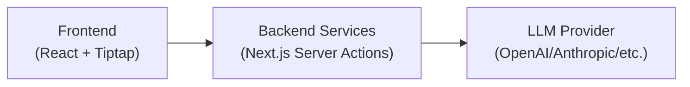

# AI Agent Custom LLM Demos

A comprehensive Next.js project showcasing how to integrate the Tiptap AI Agent extension with a custom backend and AI model provider. This repository contains **12 complete demos** demonstrating different integration patterns and capabilities. It follows the [Custom LLM Integration guides](https://tiptap.dev/docs/content-ai/capabilities/agent/custom-llms) available in our docs.

## 📂 Demo Categories

This repository contains three categories of demos, each with implementations for all four supported adapters:

### 1. **Basic Demos** (Getting Started)

Simple implementations showing the fundamental integration patterns:

- [Vercel AI SDK](https://tiptap.dev/docs/content-ai/capabilities/agent/custom-llms/get-started/vercel-ai-sdk)
- [OpenAI Responses API](https://tiptap.dev/docs/content-ai/capabilities/agent/custom-llms/get-started/openai-responses)
- [OpenAI Chat Completions API](https://tiptap.dev/docs/content-ai/capabilities/agent/custom-llms/get-started/openai-chat-completions)
- [Anthropic Claude Messages API](https://tiptap.dev/docs/content-ai/capabilities/agent/custom-llms/get-started/anthropic-messages)

### 2. **Client-Side Tools Demos**

Demonstrations of [custom client-side tools](https://tiptap.dev/docs/content-ai/capabilities/agent/custom-llms/client-side-tools) that interact with the editor:

- Vercel AI SDK + Replace Tool
- OpenAI Responses API + Replace Tool
- OpenAI Chat Completions API + Replace Tool
- Anthropic Claude Messages API + Replace Tool

### 3. **Server-Side Tools Demos**

Examples of server-side tools that fetch external data:

- [Vercel AI SDK + Weather Tool](https://tiptap.dev/docs/content-ai/capabilities/agent/custom-llms/server-side-tools/vercel-ai-sdk)
- [OpenAI Responses API + Weather Tool](https://tiptap.dev/docs/content-ai/capabilities/agent/custom-llms/server-side-tools/openai-responses)
- [OpenAI Chat Completions API + Weather Tool](https://tiptap.dev/docs/content-ai/capabilities/agent/custom-llms/server-side-tools/openai-chat-completions)
- [Anthropic Claude Messages API + Weather Tool](https://tiptap.dev/docs/content-ai/capabilities/agent/custom-llms/server-side-tools/anthropic-messages)

## 🚀 Quick Start

### 1. Download the project

```bash
npx degit https://github.com/ueberdosis/ai-agent-custom-llm-demos
```

### 2. Authenticate to the Tiptap Private Registry

This project contains Tiptap Pro extensions that are published in Tiptap’s private npm registry. To install them, you need to configure your `.npmrc` file with the necessary authentication details. Follow the [private registry guide](https://tiptap.dev/docs/guides/pro-extensions) to set it up.

### 3. Installation

```bash
npm install
```

### 4. Environment Variables

Create a `.env.local` file:

```bash
OPENAI_API_KEY=your_openai_api_key_here
# Optional, only needed for Anthropic Claude Messages API
ANTHROPIC_API_KEY=your_anthropic_api_key_here
```

### 5. Run the Development Server

```bash
npm run dev
```

Visit `http://localhost:3000` to see all available demos.

## 🏗️ Architecture Overview

Each demo follows a consistent three-layer architecture:



## 📁 Project Structure

```text
├── app/                                   # Next.js pages
│   ├── basic/                             # Basic demos (getting started)
│   │   ├── openai-responses-api/          # OpenAI Responses API demo
│   │   ├── openai-chat-completions-api/   # OpenAI Chat Completions demo
│   │   ├── vercel-ai-sdk/                 # Vercel AI SDK demo
│   │   └── anthropic-messages/            # Anthropic Claude demo
│   ├── client-side-tools/                 # Client-side tools demos
│   │   ├── openai-responses-api/          # With custom replace tool
│   │   ├── openai-chat-completions-api/   # With custom replace tool
│   │   ├── vercel-ai-sdk/                 # With custom replace tool
│   │   └── anthropic-messages/            # With custom replace tool
│   └── server-side-tools/                 # Server-side tools demos
│       ├── openai-responses-api/          # With weather tool
│       ├── openai-chat-completions-api/   # With weather tool
│       ├── vercel-ai-sdk/                 # With weather tool
│       └── anthropic-messages/            # With weather tool
└── src/
    ├── services/                          # Next.js Server Actions
    │   ├── basic/                         # Basic demo services
    │   ├── client-side-tools/             # Client-side tools services
    │   └── server-side-tools/             # Server-side tools services
    └── view/                              # React components
        ├── basic/common/                  # Basic demo UI
        ├── client-side-tools/common/      # Client-side tools UI
        └── server-side-tools/common/      # Server-side tools UI
```

## 📖 Demo Details

### Basic Demos

These demos show the fundamental integration patterns for each adapter:

#### 🔗 Routes

- `/basic/openai-responses-api` - OpenAI Responses API integration
- `/basic/openai-chat-completions-api` - OpenAI Chat Completions integration
- `/basic/vercel-ai-sdk` - Vercel AI SDK integration
- `/basic/anthropic-messages` - Anthropic Claude Messages integration

#### 📂 Code Structure

- **Service**: `src/services/basic/[adapter].ts`
- **Route**: `app/basic/[adapter]/page.tsx`
- **Frontend**: `src/view/basic/common/index.jsx`

#### 🎯 What You'll Learn

- How to set up the AI Agent toolkit with different adapters
- How to format chat messages for each LLM provider
- How to handle API responses and errors
- Basic system prompt configuration

### Client-Side Tools Demos

These demos show how to implement custom client-side tools that interact with the editor:

#### 🔗 Routes

- `/client-side-tools/openai-responses-api` - With custom replace tool
- `/client-side-tools/openai-chat-completions-api` - With custom replace tool
- `/client-side-tools/vercel-ai-sdk` - With custom replace tool
- `/client-side-tools/anthropic-messages` - With custom replace tool

#### 📂 Code Structure

- **Service**: `src/services/client-side-tools/[adapter].ts`
- **Route**: `app/client-side-tools/[adapter]/page.tsx`
- **Frontend**: `src/view/client-side-tools/common/app-with-replace-tool.jsx`
- **Tool Handler**: `src/view/client-side-tools/common/replace-tool-handler.js`

#### 🎯 What You'll Learn

- How to create custom client-side tool handlers
- How to define tool schemas for validation
- How to modify editor content programmatically
- How to integrate custom tools with the AI Agent provider

#### 🛠️ Featured Tool: Replace Tool

The replace tool allows users to ask the AI to replace all occurrences of a word or phrase in the document. Try asking: _"Replace all instances of 'company' with 'organization'"_

### Server-Side Tools Demos

These demos demonstrate server-side tools that fetch external data:

#### 🔗 Routes

- `/server-side-tools/openai-responses-api` - With weather tool
- `/server-side-tools/openai-chat-completions-api` - With weather tool
- `/server-side-tools/vercel-ai-sdk` - With weather tool
- `/server-side-tools/anthropic-messages` - With weather tool

#### 📂 Code Structure

- **Service**: `src/services/server-side-tools/[adapter].ts`
- **Route**: `app/server-side-tools/[adapter]/page.tsx`
- **Frontend**: `src/view/server-side-tools/common/index.jsx`

#### 🎯 What You'll Learn

- How to implement server-side tools that call external APIs
- How to handle tool call loops and responses
- How to format tools for different LLM providers
- How to manage asynchronous tool execution

#### 🌤️ Featured Tool: Weather Tool

The weather tool provides dummy weather data for various cities. Try asking: _"What's the weather like in Tokyo?"_

## 🔧 Key Implementation Details

### Library Structure

This project uses the following npm packages for the AI Agent functionality:

- `@tiptap-pro/extension-ai-agent` - Client-side library
- `@tiptap-pro/extension-ai-agent-server` - Server-side library
- `@tiptap-pro/extension-ai-changes` - Review changes made by the AI Agent

### Adapter Patterns

Each demo implements the same functionality using different adapters:

- **OpenAI Responses API**: Uses the newer responses format
- **OpenAI Chat Completions API**: Uses the traditional chat completions format
- **Vercel AI SDK**: Leverages the Vercel AI SDK for provider abstraction
- **Anthropic Claude**: Direct integration with Claude's Messages API

## 📚 Learning Path

1. **Start with Basic Demos**: Understand the fundamental integration patterns
2. **Explore Client-Side Tools**: Learn how to extend the editor with custom functionality
3. **Study Server-Side Tools**: See how to integrate external data sources
4. **Compare Adapters**: Notice the differences and similarities between implementations

## 🚀 Available Scripts

- `npm run dev` - Start development server
- `npm run build` - Create production build
- `npm start` - Start production server
- `npm run lint` - Run ESLint

## 📖 Learn More

- [Tiptap AI Agent Documentation](https://tiptap.dev/docs/content-ai/capabilities/agent/overview)
- [Custom LLM Integration Guide](https://tiptap.dev/docs/content-ai/capabilities/agent/custom-llms)
- [Client-Side Tools Guide](https://tiptap.dev/docs/content-ai/capabilities/agent/custom-llms/client-side-tools)
- [Server-Side Tools Guide](https://tiptap.dev/docs/content-ai/capabilities/agent/custom-llms/server-side-tools)

## 💬 Support

For support, refer to the following resources:

- [Tiptap Documentation](https://tiptap.dev/docs)
- [Tiptap Community](https://github.com/ueberdosis/tiptap/discussions)
- Contact your Tiptap account manager for enterprise support

## 📄 License

This project is licensed under the MIT License.
